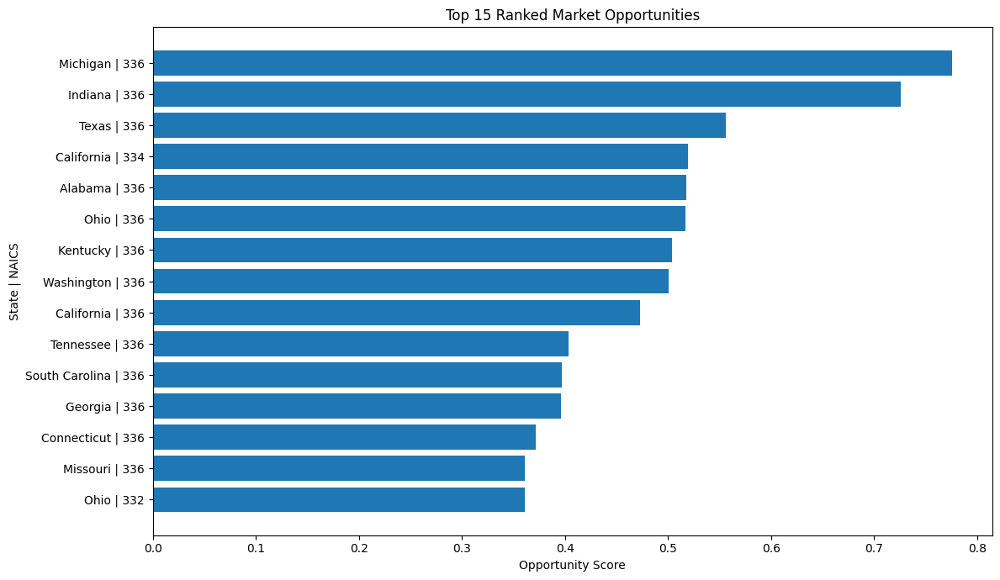

## Overview
This project builds an interactive decision-support system that identifies high-value industrial market opportunities using structured economic data, statistical scoring, clustering, and LLM-generated insights.

**Live Link to Interactive Dashboard** : https://industrialmarketinteldashboard-mygy8flzts2pmhzbwvuqqc.streamlit.app/

Users can:
- Explore markets by state and industry
- Visualize opportunity positioning
- Interact with LLM-driven insights

## Methods
The pipeline transforms raw NAICS manufacturing data into actionable market insights through several stages:

Data Preparation (SQL)
Aggregation of state–industry–year data and filtering to relevant manufacturing sectors (NAICS 332–336)
Feature Engineering:
- Market size (receipts)
- Year-over-year growth
- Industry share within state
- Relative rankings and derived indicators
A weighted composite scoring model combining:
- Scale (50%)
- Growth (30%)
- Regional concentration (20%)
Segmentation (K-Means Clustering)
Rule-Based Classification
LLM Integration
Deployment (Streamlit)

## Top 15 Ranked Opportunities on the Market

This chart highlights the top 15 state–industry combinations based on the engineered opportunity score, which balances market size, growth, and regional concentration.

These results represent the most actionable opportunities, combining sufficient scale with continued expansion potential.

